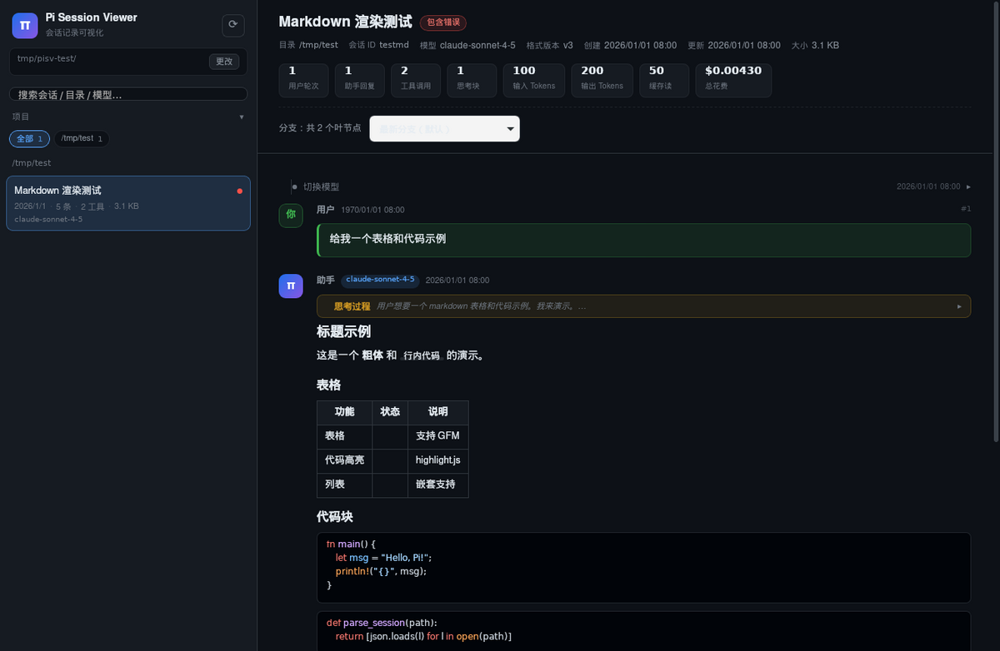

<div align="center">

# π Pi Session Viewer

**把 pi coding agent 的 JSONL 会话记录变成可读的对话时间线**

一个基于 Tauri + React + Rust 的原生桌面工具：扫描目录 → 解析会话 → 结构化呈现

<sub>中文 · <a href="README_EN.md">English</a></sub>

[](https://github.com/Ray4AI/pi-session-viewer/releases)
[](LICENSE)
[](https://tauri.app)
[](https://www.rust-lang.org)
[](#下载)

</div>

---

## 为什么需要它？

pi 会把每次会话完整记录到 `~/.pi/agent/sessions/` 下的 JSONL 文件里 —— 消息、思考过程、工具调用、工具输出、Token 用量、模型切换、分支与压缩。信息很全，但**直接打开就是一堆 JSON**。

**Pi Session Viewer** 把这些文件解析成结构化的聊天界面：谁说了什么、调用了哪个工具、参数是什么、返回了什么、花了多少 Token —— 一目了然。



---

## 功能

### 📂 会话浏览
- 递归扫描任意目录下的 `.jsonl` 会话文件（默认 `~/.pi/agent/sessions/`）
- 按**项目目录**自动分组，支持一键筛选
- 跨会话**全文搜索**：标题、目录、模型、会话 ID、首条消息
- 每条会话显示：消息数、工具调用数、文件大小、模型、错误标记

### 💬 结构化对话时间线
| 内容 | 呈现方式 |
|------|----------|
| 用户消息 | 绿色气泡，保留原始换行 |
| 助手回复 | **完整 Markdown 渲染**（表格、列表、引用、链接） |
| 代码块 | 语法高亮（highlight.js，自动语言识别） |
| 思考过程 | 可折叠的 💭 思考块，默认折叠并显示摘要 |
| 工具调用 | 可展开卡片：命令 / 文件路径 / 参数一屏可见 |
| 工具输出 | 等宽代码块，超长自动截断并提供字符数提示 |
| 文件编辑 | **红绿 diff 视图**，`edit` 的 oldText/newText 并排呈现 |
| 网页抓取 | 输出按 Markdown 渲染，而非原始字符串 |

### 📊 用量统计
- 每次回复的 Token 明细：输入 / 输出 / 缓存读 / 缓存写 / 总计 / 花费
- 会话累计统计条：用户轮次、助手回复、工具调用、思考块、总 Token、总花费

### 🌳 分支与事件
- 完整解析 pi 的 `id`/`parentId` 树结构，**默认跟随最新分支**
- 多分支会话提供下拉切换（叶节点选择）
- 模型切换、思考等级、重命名、上下文压缩、分支摘要等以时间线事件呈现
- 隐藏的扩展消息（`display: false`）自动跳过

### 🔒 隐私
- **完全本地**：所有解析在 Rust 后端内存中完成，不联网、不上传
- **只读**：绝不修改任何会话文件
- 单文件大小 / Token 上限保护，避免超大输出拖垮界面

---

## 下载

前往 [Releases](https://github.com/Ray4AI/pi-session-viewer/releases) 下载：

| 平台 | 文件 |
|------|------|
| **Windows 10/11 x64** | `Pi-Session-Viewer_x.y.z_x64-setup.exe`（推荐）或 `.msi` |
| macOS (Apple Silicon) | `Pi.Session.Viewer_x.y.z_aarch64.dmg` |
| Linux x64 | `.AppImage` 或 `.deb` |

> Windows 用户直接运行 `setup.exe` 安装即可，无需任何运行时依赖（Tauri 使用系统自带 WebView2）。

---

## 使用

1. 启动应用，自动扫描 `~/.pi/agent/sessions/`
2. 左侧点击任意会话 → 右侧显示结构化对话
3. 点击「**更改**」可切换到其他目录（例如备份的会话归档）
4. 点击工具卡片标题展开参数与输出
5. 点击 💭 思考过程展开完整推理内容

**自定义会话目录**：设置环境变量 `PI_SESSIONS_DIR` 可覆盖默认路径。

---

## 从源码构建

### 依赖
- [Node.js](https://nodejs.org/) ≥ 18
- [Rust](https://rustup.rs/) ≥ 1.77
- 平台依赖见 [Tauri prerequisites](https://tauri.app/start/prerequisites/)
  - Linux: `libwebkit2gtk-4.1-dev`、`libgtk-3-dev`、`librsvg2-dev`、`patchelf`

### 开发

```bash
npm install
npm run tauri dev
```

### 构建

```bash
npm run tauri build
```

产物在 `src-tauri/target/release/bundle/`。

### 从 Linux 交叉编译 Windows 安装包

需要 `mingw-w64` 与 `nsis`（`sudo apt-get install mingw-w64 nsis`）：

```bash
rustup target add x86_64-pc-windows-gnu
npm run tauri build --target x86_64-pc-windows-gnu
```

产物：`src-tauri/target/x86_64-pc-windows-gnu/release/bundle/nsis/*-setup.exe`。
Tauri 将交叉编译标记为实验性；正式发布由 [release workflow](.github/workflows/release.yml) 在 `windows-latest` 上原生构建。

### 测试

```bash
npm run test                                  # 前端：分支解析、渲染模型、格式化
cargo test --manifest-path src-tauri/Cargo.toml --lib   # 后端：JSONL 解析、扫描、分组
```

---

## 架构

```
pi-session-viewer/
├── src/                        # React 前端
│   ├── types.ts                # 与 Rust 结构对应的类型
│   ├── sessionModel.ts         # 分支重建 / 渲染模型 / 统计（含单元测试）
│   ├── api.ts                  # Tauri invoke 封装
│   ├── App.tsx                 # 布局、会话头、事件行
│   └── components/
│       ├── Sidebar.tsx         # 项目分组、搜索、会话列表
│       ├── MessageView.tsx     # 用户/助手/工具结果/思考块
│       ├── ToolCallView.tsx    # 工具卡片、参数、diff、输出
│       └── Markdown.tsx        # Markdown + 代码高亮
└── src-tauri/                  # Rust 后端
    ├── src/session.rs          # JSONL 解析、扫描、项目分组（含单元测试）
    └── src/lib.rs              # Tauri 命令注册
```

**设计原则**：Rust 负责快速扫描与容错解析，前端只接收结构化 JSON 并专注渲染。`sessionModel.ts` 中的分支重建逻辑与 Rust 解析器分别测试，互不依赖。

### 支持的数据格式

完整支持 [pi session format v1/v2/v3](https://github.com/earendil-works/pi-mono/blob/main/packages/coding-agent/docs/session-format.md)：

- 条目类型：`session`、`message`、`model_change`、`thinking_level_change`、`compaction`、`branch_summary`、`custom`、`custom_message`、`session_info`、`label`
- 消息角色：`user`、`assistant`、`toolResult`、`custom`、`branchSummary`、`compactionSummary`
- 内容块：`text`、`thinking`、`toolCall`、`image`

对损坏行容错：无法解析的行会被跳过并标记，不影响整个会话加载。

---

## License

[MIT](LICENSE)

---

<div align="center">

**如果这个工具帮到了你，欢迎点个 ⭐**

</div>
